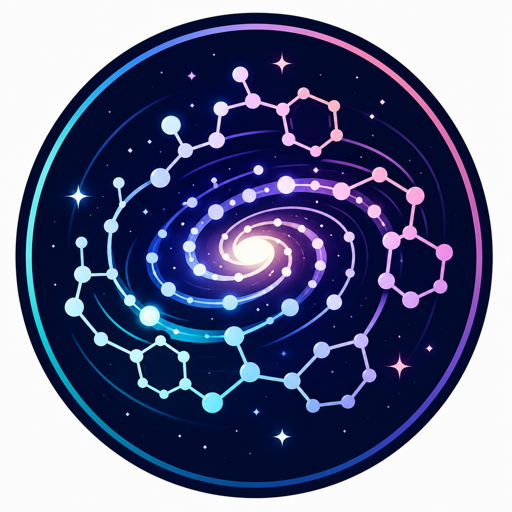

<p align="center">
  
</p>

# Molecular Galaxy Atlas

## 中文說明

Molecular Galaxy Atlas（MGA，分子星系圖鑑）是一座互動式 3D 化學空間圖鑑，將 3,000 多個真實、可追溯來源的分子，依照十個 Chemical Families 排列成不同星系。

**線上探索：** https://studio6-02.github.io/MGA-public/

### 公開資料

瀏覽器使用的分子資料位於 `public/datasets/demo`。每個有冷知識的星體都會在介紹卡片中顯示可點擊的 `Reference: 文獻名稱` 連結。

已核准的 featured facts 與引用資料也整理在 `data/molecule-facts.yml`，方便直接閱讀與人工確認。完整研究資料庫、草稿、證據蒐集內容與內部審核流程則保留在另一個 private repository。詳細資料來源與公開邊界請見 [DATA_SOURCES.md](DATA_SOURCES.md)。

### 本機執行

```bash
npm ci
npm run validate:public
npm run dev
```

### 建置

```bash
npm run build
```

每次 push 到 `main` 時，GitHub Actions 都會先驗證公開資料，再將建置完成的 `dist/` 部署至 GitHub Pages。

---

## English

Molecular Galaxy Atlas (MGA) is a static 3D atlas of real, source-tracked molecules arranged as ten chemical galaxies.

**Explore the atlas:** https://studio6-02.github.io/MGA-public/

## Public Data

The browser-ready molecule tiles are stored in `public/datasets/demo`. Approved featured facts and their reference links are also available in `data/molecule-facts.yml` for human review.

The canonical research database, drafts, evidence collection, and review workflow live in a separate private repository. Browser-visible facts and citations are intentionally public. See [DATA_SOURCES.md](DATA_SOURCES.md) for provenance and publication boundaries.

## Run Locally

```bash
npm ci
npm run validate:public
npm run dev
```

## Build

```bash
npm run build
```

Every push to `main` validates the public dataset and deploys the resulting `dist/` directory through GitHub Pages Actions.
